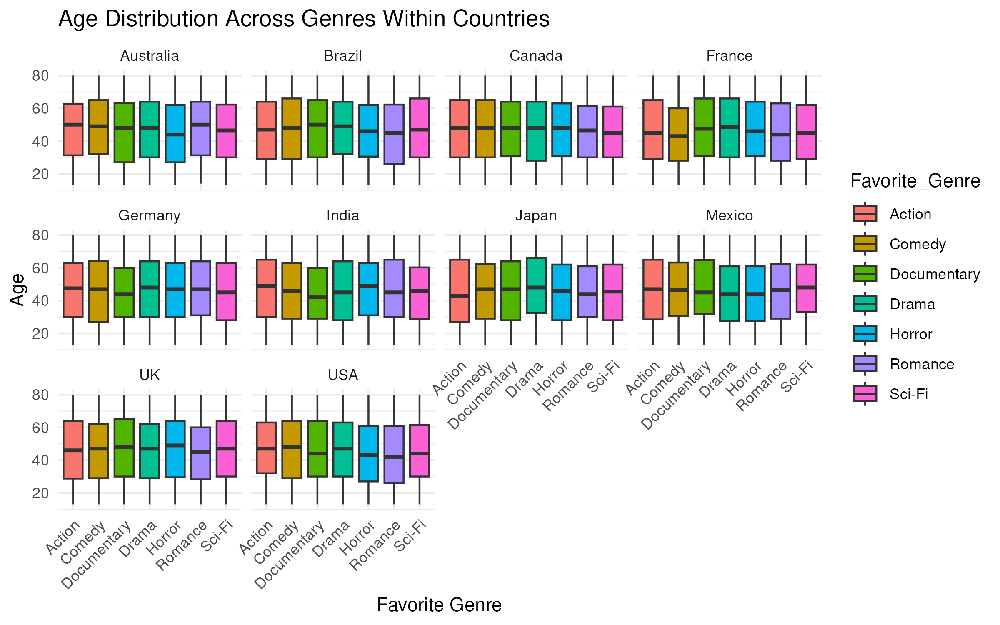
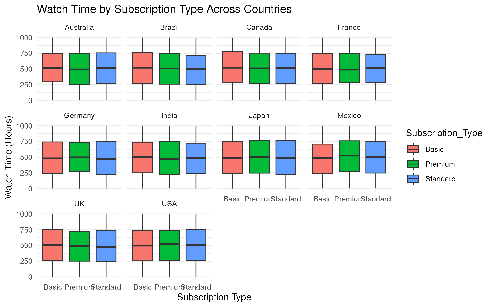
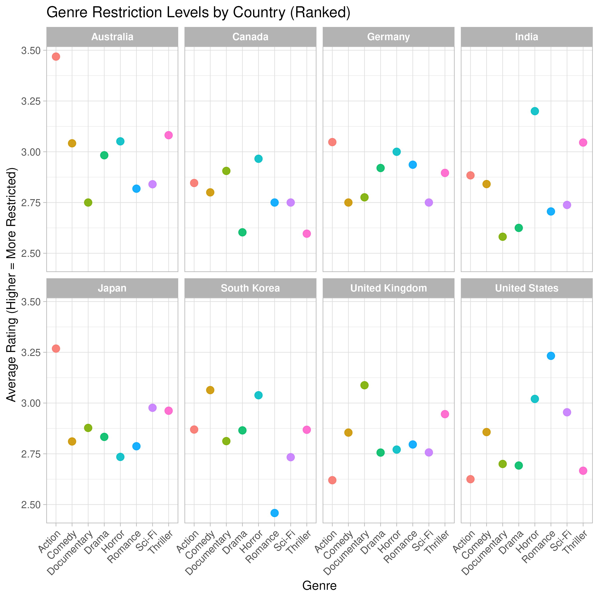
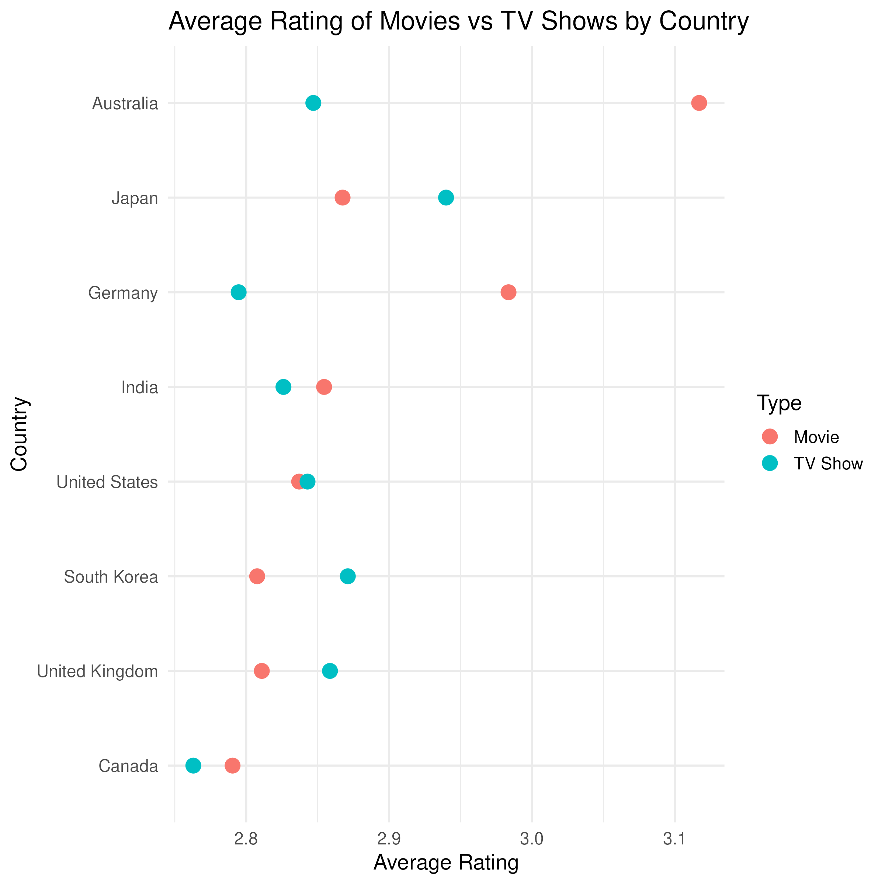
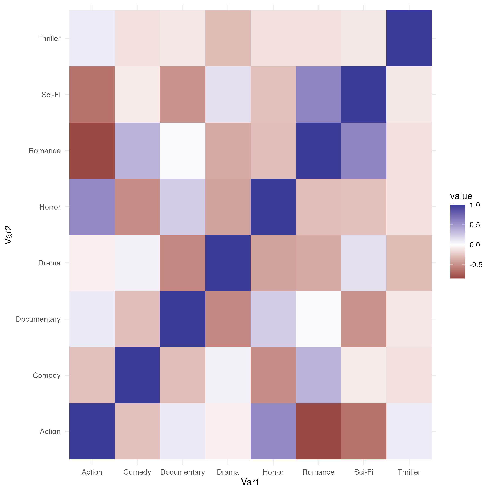

# 0. Load and Clean Data

Before running this report, the raw Netflix CSV files are processed using `load_data.R` to create cleaned `.rds` files in `data/processed/`.\
This ensures reproducibility and avoids hardcoding local paths.

If the `.rds` files are not present, the report will stop and notify you.

this was the plan but i couldnt get the paths to be right to save my life so now i have the cleaning just on the top of this script. :\|

```{r setup, include=FALSE}
# 
# # Tell knitr to use the project root as base directory
knitr::opts_knit$set(root.dir = normalizePath(".."))

# Create processed folder if it doesn't exist
if(!dir.exists("data/processed")) dir.create("data/processed")
library(tidyverse)

# Load raw data
users_data <- read.csv("/home/rstudio/project/data/raw/netflix_users.csv")
mov_show_data <- read.csv("/home/rstudio/project/data/raw/Netflix_Movies_and_TV_Shows.csv")

head(users_data)
clean_user_data <- users_data |>  select(-User_ID,  -Name, -Last_Login)

head(mov_show_data)
mov_show_data <- mov_show_data |>  select(-Title)
 # cleaning the user data file


# Save filtered data# Save filtered dataTitle
saveRDS(clean_user_data, file = "/home/rstudio/project/data/processed/clean_user_data.rds")
saveRDS(mov_show_data, file ="/home/rstudio/project/data/processed/mov_show_data.rds")


rm(users_data)


```

# 1. This is an overall report that summarizes the analysis of Netflix user data, and the following content I've investigated the :

-   Age and Genre preferences across countries -Subscription Type and watch time
-   Content rating across genres and countries
-   Key correletions aross varuis subsets

# 2. Data Overview

Raw Data was cleaned used the "Load Data.R" Script. Please Have that ran before running the rest of this script

```{r}
users_data <- readRDS("/home/rstudio/project/data/processed/clean_user_data.rds")
mov_show_data <- readRDS("/home/rstudio/project/data/processed/mov_show_data.rds")

dim(users_data)
dim(mov_show_data)
head(users_data)
head(mov_show_data)

```

# 3. A) Analysis of Netflix User Analysis

```{r}
knitr::include_graphics("figures/age_genre_by_country_plot.png")
```

and with some statistical analysis we can see the key findings here

```{r}
age_genre_anova <- read.csv("data/processed/age_genre_anova.csv")
tibble(age_genre_anova)

```

Overall finding being there are no significant differences but there are definatly some countries that really lack in their genre ranking variation. For example the US hs pretty diverse with the content we watch at a pval of 0.10 while Germany has a pvalue of 0.86. While both are non sig, this is showing me there is a larger divide in the US than Germany.

We can also see here ( again not signigicant but interesting) there is such a difference in the TV/Movie ratings on the prefered content. See below for more. This is one of the areas we can actually see some variation within the data.

```{r}
knitr::include_graphics("figures/genre_rating_country.png")
```



# 3. B) Watch Time by Subscription Type

```{r}
knitr::include_graphics("figures/watch_time_by_subscrip_plot.png")

```



With the overall findings being here if you want more details:

```{r}
watch_summary <- read.csv("data/processed/watch_summary.csv")
watch_summary

```

Overall findings being that the people who do pay for premium do watch more the other packages ( standard and basic) but not by much. There is some slight variation within countries but not much and not enought to be significant.

# 4. Netflix Content Analysis

# 4. A) Movies and TV Show Count by Country

```{r}
knitr::include_graphics("figures/genre_rating_country.png")


```



Here we can see some of the more granular changes within the countries and the ratings of the media they perfer. We can see here for example that Japan overall doesn't consume a lot of media that is rated Mature or R, its mosty seen in action. This compared to us here in the US having actions watched are rated pretty low, while our romance is rated M or R. Super interesting.

# 4. B) Average Media Rating by Country

```{r}
knitr::include_graphics("figures/average_media_rating_country.png")

```



From here we are comparing the ratings for each of the types of media ( tv or movies) per county and how the ratings are. Canda watches the most overall mild media in both TV shows and movies while movies in Australia are incredibly more restricted than the TV show. the US ratings are pretty similar within the overall media (suprised but cool) overall media in the US is between PG and and PG13.

KEY FOR REFERENCE

rating_map \<- ( "G" = 1, "TV-G" = 1, "PG" = 2, "TV-PG" = 2, "PG-13" = 3, "TV-14" = 3, "R" = 4, "TV-MA" = 5 )

# 4. C) Correlation Between Genre

```{r}
knitr::include_graphics("figures/correlation_genre_by_genre_plot.png")

```



This last plot is just showing how likely the pairs of shows coincide. Here we can see the people who don't like Romance really like Action, and overall it seems like thriller is the most average-ly liked, not a lot of red or blue there. The value scale is not super drastic but cool to see that some of the genres that you'd think go together kinda do. Don't like horror? then you'll prolly like comedy, drama, possibly a little romance and even sci-fi.
